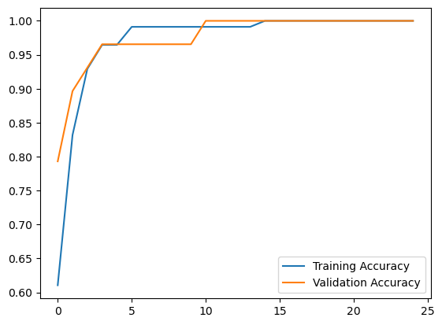
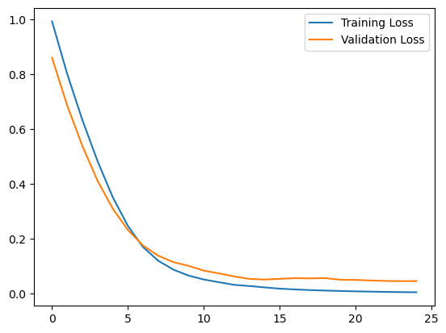

# ANN Wine Classification — First Deep Learning Project

## Project Overview

This project is my **first hands-on Deep Learning project**, created to apply the Artificial Neural Network (ANN) concepts I learned in practice.

The project uses the **Wine dataset** from Scikit-learn and builds a fully connected neural network for multi-class classification.

Rather than focusing on advanced Deep Learning techniques, this project demonstrates the practical implementation of core ANN concepts:

**Data Preparation → EDA → Train/Validation/Test Split → Feature Scaling → ANN Architecture → Training → Early Stopping → Evaluation → Learning Curves**

---

## Objective

The objective is to build an Artificial Neural Network that can classify wine samples into one of **three target classes** based on their chemical properties.

This project was created as a practical application of the ANN fundamentals learned during my Deep Learning studies.

---

## Dataset

The project uses the built-in **Wine dataset** provided by `sklearn.datasets.load_wine`.

### Dataset Shape

The dataset contains:

- **178 samples**
- **13 input features**
- **3 target classes**

The final DataFrame contains 14 columns:

- 13 feature columns
- 1 target column

### Features

The input features describe different chemical properties of the wine, including:

- Alcohol
- Malic acid
- Ash
- Alcalinity of ash
- Magnesium
- Total phenols
- Flavanoids
- Nonflavanoid phenols
- Proanthocyanins
- Color intensity
- Hue
- OD280/OD315 of diluted wines
- Proline

---

## Exploratory Data Analysis

The notebook performs basic EDA before model development:

- Dataset information and data types
- Dataset shape
- Descriptive statistics
- Feature distribution histograms
- Missing-value inspection through `df.info()`

The dataset contains **no missing values**.

---

## Data Splitting

The data is divided into three subsets:

| Dataset | Samples | Percentage |
|---|---:|---:|
| Training | 113 | 63.5% |
| Validation | 29 | 16.3% |
| Test | 36 | 20.2% |

The split uses:

```python
random_state=42
```

The validation set is used during training to monitor model performance, while the test set is kept for final evaluation.

---

## Feature Scaling

Because Artificial Neural Networks are sensitive to feature scale, `StandardScaler` is used.

The scaler is fitted **only on the training data**:

```python
scaler.fit_transform(X_train)
```

The validation and test sets are transformed using the same fitted scaler:

```python
scaler.transform(X_val)
scaler.transform(X_test)
```

This keeps the preprocessing consistent and avoids using validation/test information when fitting the scaler.

---

## ANN Architecture

The model is implemented using **TensorFlow / Keras** with a Sequential architecture.

```text
Input: 13 features
        ↓
Dense(80, ReLU)
        ↓
Dense(60, ReLU)
        ↓
Dense(32, ReLU)
        ↓
Dense(3, Softmax)
```

### Model Configuration

| Component | Configuration |
|---|---|
| Input features | 13 |
| Hidden Layer 1 | 80 neurons, ReLU |
| Hidden Layer 2 | 60 neurons, ReLU |
| Hidden Layer 3 | 32 neurons, ReLU |
| Output Layer | 3 neurons, Softmax |
| Total parameters | 8,031 |
| Optimizer | Adam |
| Loss | Sparse Categorical Crossentropy |
| Metric | Accuracy |

The **Softmax** output layer produces probabilities for the three wine classes.

---

## Training

The ANN is trained with:

- **Maximum epochs:** 25
- **Batch size:** 20
- **Optimizer:** Adam
- **Validation data:** Validation set
- **Early Stopping:** Enabled
- **Patience:** 5 epochs
- **Restore best weights:** Enabled

Early stopping monitors validation loss and restores the model weights from the best-performing epoch.

The best weights were restored from **epoch 24**.

---

## Results

### Test Accuracy

The final model achieved:

**Test Accuracy: 100%**

The test set contained 36 samples, and all 36 were classified correctly.

### Classification Report

| Class | Precision | Recall | F1-Score | Support |
|---|---:|---:|---:|---:|
| 0 | 1.00 | 1.00 | 1.00 | 14 |
| 1 | 1.00 | 1.00 | 1.00 | 14 |
| 2 | 1.00 | 1.00 | 1.00 | 8 |
| **Accuracy** | | | **1.00** | **36** |

### Confusion Matrix

```text
[[14  0  0]
 [ 0 14  0]
 [ 0  0  8]]
```

Every test sample was classified correctly.

> Because this is a relatively small built-in dataset, the 100% test accuracy should be interpreted in the context of the dataset size and split rather than as evidence that the same performance would generalize to every unseen dataset.

---

## Learning Curves

### Training & Validation Accuracy



### Training & Validation Loss




The notebook visualizes:

- Training vs. Validation Accuracy
- Training vs. Validation Loss

These plots help monitor learning behavior and identify potential overfitting during training.

---

## Key Deep Learning Concepts Applied

This project was built to put the following concepts into practice:

- Artificial Neural Networks
- Dense / Fully Connected Layers
- Input and Output Layers
- ReLU Activation
- Softmax Activation
- Multi-Class Classification
- Sparse Categorical Crossentropy
- Adam Optimizer
- Batch Size
- Epochs
- Validation Data
- Feature Scaling
- Early Stopping
- Model Evaluation
- Confusion Matrix
- Classification Report
- Training and Validation Curves

---

## Technologies

- Python
- NumPy
- Pandas
- Matplotlib
- Seaborn
- Scikit-learn
- TensorFlow
- Keras
- Jupyter Notebook

---

## Project Structure

```text
ANN-Wine-Classification/
├── ANN_Project.ipynb
├── README.md
└── requirements.txt
```

---

## How to Run

### 1. Install the dependencies

```bash
pip install -r requirements.txt
```

### 2. Open the notebook

```text
ANN_Project.ipynb
```

### 3. Run the cells sequentially

The dataset is loaded directly from Scikit-learn, so no external dataset files are required.

---

## What I Learned From This Project

This project represents my **first practical Deep Learning implementation** after studying the fundamentals of Artificial Neural Networks.

It helped me move from understanding ANN concepts theoretically to actually building, training, monitoring, and evaluating a neural network.

The main goal was not to build a highly complex model, but to **apply what I learned through a complete end-to-end example**.

---

## Author

**Ahmed Abdelfattah**

Aspiring **Applied AI / LLM Engineer**
